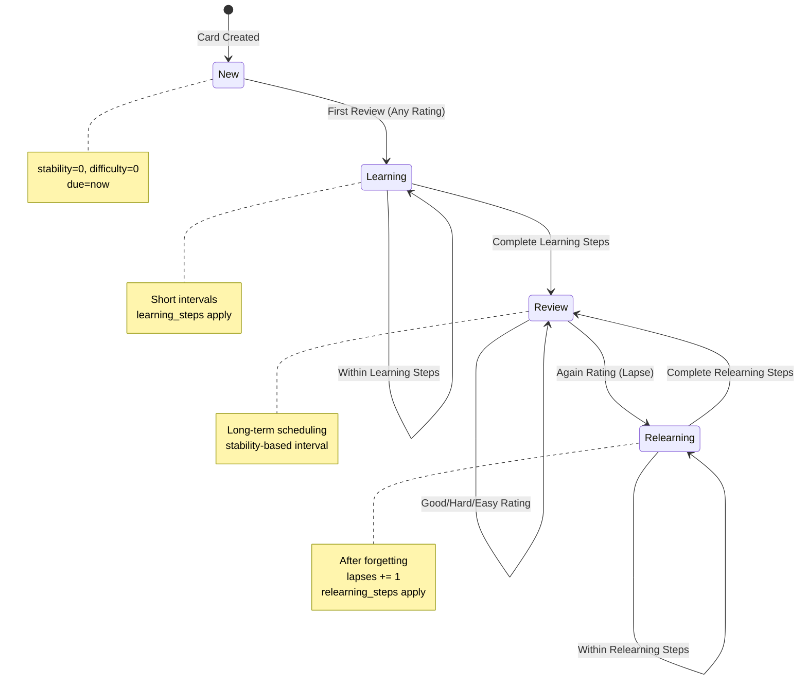

# FSRS Logic Structure - MemoryDeckPC

> **Source of Truth** for the Free Spaced Repetition Scheduler (FSRS) implementation.

---

## Table of Contents

1. [Overview](#overview)
2. [Database Schema](#database-schema)
3. [Card States](#card-states)
4. [State Transitions](#state-transitions)
5. [Core Algorithm](#core-algorithm)
6. [Rating System](#rating-system)
7. [Integration Points](#integration-points)
8. [Key Files Reference](#key-files-reference)

---

## Overview

MemoryDeckPC uses **ts-fsrs** (TypeScript implementation of FSRS-6) for spaced repetition scheduling. The algorithm determines when a card should be reviewed next based on the user's performance history.

### FSRS Version
- **Library**: `ts-fsrs` (located in `/ts-fsrs/packages/fsrs/`)
- **Algorithm Version**: FSRS-6 (21 parameters)
- **Default Parameters**: See `ts-fsrs/packages/fsrs/src/constant.ts`

---

## Database Schema

### Progress Table Fields

| Field | Type | Description | FSRS Mapping |
|-------|------|-------------|--------------|
| `term_id` | number | Foreign key to Term | Card identifier |
| `due` | string (ISO date) | Next review date | `Card.due` |
| `stability` | number | Memory stability (days) | `Card.stability` |
| `difficulty` | number | Intrinsic difficulty (1-10) | `Card.difficulty` |
| `elapsed_days` | number | Days since last review | `Card.elapsed_days` (deprecated in v6) |
| `scheduled_days` | number | Interval to next review | `Card.scheduled_days` |
| `reps` | number | Total review count | `Card.reps` |
| `lapses` | number | Times forgotten (Again rating) | `Card.lapses` |
| `state` | number (enum) | Current card state | `Card.state` |
| `last_review` | string (ISO date) | Last review timestamp | `Card.last_review` |

### TypeScript Interface

```typescript
// types.ts
interface Progress {
    term_id: number;
    due: string;
    stability: number;      // S: Memory stability
    difficulty: number;     // D: Intrinsic difficulty (1-10)
    elapsed_days: number;   // Days since last review
    scheduled_days: number; // Interval to next review
    reps: number;           // Total review count
    lapses: number;         // Number of times forgotten
    state: State;           // Card state enum
    last_review?: string;   // Last review timestamp
}
```

---

## Card States

### State Enum Values

| State | Value | Description |
|-------|-------|-------------|
| `New` | 0 | Never reviewed |
| `Learning` | 1 | First learning phase (short intervals) |
| `Review` | 2 | Graduated to long-term memory |
| `Relearning` | 3 | Forgotten, re-learning phase |

### State Characteristics

```
┌─────────────────────────────────────────────────────────────────┐
│                         CARD STATES                              │
├─────────────┬───────────────────────────────────────────────────┤
│ New         │ stability=0, difficulty=0, reps=0, lapses=0       │
│             │ No review history, due immediately                │
├─────────────┼───────────────────────────────────────────────────┤
│ Learning    │ Short intervals (minutes/hours)                   │
│             │ Controlled by learning_steps parameter            │
│             │ Default steps: [1m, 10m]                          │
├─────────────┼───────────────────────────────────────────────────┤
│ Review      │ Long intervals (days/months)                      │
│             │ stability-based scheduling                         │
│             │ scheduled_days >= 1                                │
├─────────────┼───────────────────────────────────────────────────┤
│ Relearning  │ After lapse (Again in Review state)               │
│             │ Controlled by relearning_steps parameter           │
│             │ lapses counter incremented                         │
└─────────────┴───────────────────────────────────────────────────┘
```

---

## State Transitions

### Transition Diagram



### Transition Triggers

| Current State | Rating | Next State | Notes |
|---------------|--------|------------|-------|
| New | Again | Learning | Initial stability/difficulty set |
| New | Hard | Learning | Initial stability/difficulty set |
| New | Good | Learning | Initial stability/difficulty set |
| New | Easy | Learning/Review | May skip to Review if interval >= 1 day |
| Learning | Again | Learning | Reset to first learning step |
| Learning | Hard | Learning | Progress through steps |
| Learning | Good | Learning/Review | May graduate to Review |
| Learning | Easy | Review | Graduate immediately |
| Review | Again | Relearning | `lapses += 1` |
| Review | Hard | Review | Shorter interval |
| Review | Good | Review | Normal interval |
| Review | Easy | Review | Longer interval |
| Relearning | Again | Relearning | Stay in relearning |
| Relearning | Hard/Good/Easy | Review | Graduate back to Review |

### MemoryDeckPC Pipeline System

The application adds an additional learning pipeline layer on top of FSRS:

| Card State | Pipeline Phases |
|------------|-----------------|
| New | Flashcard → Matching → Quiz → Spelling |
| Learning/Relearning | Matching → Quiz |
| Review (scheduled_days < 21) | Quiz → Spelling |
| Review (scheduled_days >= 21) | Spelling only |

**Failure Handling**: If a card fails any phase, it resets to Flashcard phase.

---

## Core Algorithm

### Key Formulas

#### 1. Forgetting Curve
```
R(t, S) = (1 + FACTOR × t / (9 × S))^DECAY
```
Where:
- `R` = Retrievability (probability of recall)
- `t` = Time elapsed since last review
- `S` = Stability
- `DECAY` = -w[20]
- `FACTOR` = e^(ln(0.9) / DECAY) - 1

#### 2. Initial Stability (New Cards)
```
S₀(G) = w[G-1]
```
- `w[0]` = Again, `w[1]` = Hard, `w[2]` = Good, `w[3]` = Easy

#### 3. Initial Difficulty (New Cards)
```
D₀(G) = w[4] - e^((G-1) × w[5]) + 1
```
Clamped to [1, 10]

#### 4. Next Stability After Recall (Review State)
```
S'r(D, S, R, G) = S × (1 + e^w[8] × (11-D) × S^(-w[9]) × (e^(w[10]×(1-R)) - 1) × hard_penalty × easy_bonus)
```

#### 5. Next Stability After Forgetting (Again Rating)
```
S'f(D, S, R) = w[11] × D^(-w[12]) × ((S+1)^w[13] - 1) × e^(w[14]×(1-R))
```

#### 6. Next Difficulty
```
delta_d = -w[6] × (G - 3)
next_d = D + linear_damping(delta_d, D)
D' = w[7] × D₀(4) + (1 - w[7]) × next_d
```

#### 7. Interval Calculation
```
I = min(max(1, round(S × intervalModifier)), maximum_interval)
```

### Default Parameters (FSRS-6)

The algorithm uses 21 weight parameters (`w[0]` to `w[20]`):

| Index | Purpose |
|-------|---------|
| w[0-3] | Initial stability (Again, Hard, Good, Easy) |
| w[4-5] | Initial difficulty parameters |
| w[6-7] | Difficulty update parameters |
| w[8-10] | Stability update after recall |
| w[11-14] | Stability update after forgetting |
| w[15-16] | Hard/Easy modifiers |
| w[17-18] | Short-term stability |
| w[19] | Stability power |
| w[20] | Decay factor |

---

## Rating System

### Rating Enum

| Rating | Value | User Action | Effect |
|--------|-------|-------------|--------|
| Manual | 0 | System operation | No state change |
| Again | 1 | Forgot completely | Lapse, shorter interval |
| Hard | 2 | Remembered with difficulty | Slightly shorter interval |
| Good | 3 | Remembered normally | Standard interval |
| Easy | 4 | Remembered easily | Longer interval |

### MemoryDeckPC Rating Mapping

The application maps mistakes to ratings during session finalization:

```typescript
// hooks/useStudySession.ts
if (cardState.mistakes === 0) {
    rating = Rating.Easy;
} else if (cardState.mistakes === 1) {
    rating = Rating.Hard;
} else {
    rating = Rating.Again;
}
```

---

## Integration Points

### 1. Card Creation

```typescript
// hooks/useWords.tsx
import { createEmptyCard } from 'ts-fsrs';

const emptyCard = createEmptyCard();
// Returns: { due: now, stability: 0, difficulty: 0, state: State.New, ... }
```

### 2. Scheduling Preview

```typescript
// hooks/useStudySession.ts
import { fsrs, Rating, Card } from 'ts-fsrs';

const scheduler = fsrs();
const repeat = scheduler.repeat(card, new Date());

// Get predicted intervals for all ratings
const againInterval = repeat[Rating.Again].card.scheduled_days;
const hardInterval = repeat[Rating.Hard].card.scheduled_days;
const goodInterval = repeat[Rating.Good].card.scheduled_days;
const easyInterval = repeat[Rating.Easy].card.scheduled_days;
```

### 3. Apply Rating

```typescript
// hooks/useStudySession.ts
const result = scheduler.next(currentProgress, now, rating);
const nextCard = result.card;

await updateProgress(termId, {
    ...nextCard,
    due: nextCard.due.toISOString(),
    last_review: nextCard.last_review?.toISOString()
});
```

### 4. Retrievability Check

```typescript
// Get probability of recall
const retrievability = scheduler.get_retrievability(card, now);
// Returns: "85.50%" (string) or 0.855 (number)
```

---

## Key Files Reference

### Core FSRS Library

| File | Purpose |
|------|---------|
| `ts-fsrs/packages/fsrs/src/fsrs.ts` | Main FSRS class, `repeat()`, `next()` methods |
| `ts-fsrs/packages/fsrs/src/models.ts` | Type definitions (State, Rating, Card, etc.) |
| `ts-fsrs/packages/fsrs/src/algorithm.ts` | Core algorithm formulas |
| `ts-fsrs/packages/fsrs/src/default.ts` | Default parameters, `createEmptyCard()` |
| `ts-fsrs/packages/fsrs/src/abstract_scheduler.ts` | Scheduler base class, state routing |
| `ts-fsrs/packages/fsrs/src/impl/basic_scheduler.ts` | Learning steps implementation |
| `ts-fsrs/packages/fsrs/src/impl/long_term_scheduler.ts` | Long-term scheduling |

### Application Integration

| File | Purpose |
|------|---------|
| `types.ts` | Progress interface definition |
| `hooks/useWords.tsx` | Progress persistence, `createEmptyCard()` usage |
| `hooks/useStudySession.ts` | Study pipeline, FSRS rating mapping |
| `components/FlashcardMode.tsx` | Rating button handling |
| `components/StudySession.tsx` | Multi-phase study orchestration |
| `components/FlashcardUI.tsx` | Rating UI, predicted intervals display |

### Database

| File | Purpose |
|------|---------|
| `electron/database.ts` | SQLite operations for progress table |
| `memorydeck.db` | SQLite database file |

---

## Configuration

### FSRS Parameters

```typescript
import { fsrs, generatorParameters } from 'ts-fsrs';

const params = generatorParameters({
    request_retention: 0.9,      // Target retention rate
    maximum_interval: 36500,     // Max interval in days (100 years)
    enable_fuzz: true,           // Add randomness to intervals
    enable_short_term: true,     // Use learning steps
    learning_steps: ['1m', '10m'],     // Learning phase steps
    relearning_steps: ['10m'],   // Relearning phase steps
});

const scheduler = fsrs(params);
```

---

## Debugging Tips

### 1. Check Card State
```typescript
console.log('State:', State[card.state]); // "New", "Learning", "Review", "Relearning"
```

### 2. Preview All Outcomes
```typescript
const preview = scheduler.repeat(card, now);
for (const rating of [Rating.Again, Rating.Hard, Rating.Good, Rating.Easy]) {
    console.log(`${Rating[rating]}: ${preview[rating].card.scheduled_days} days`);
}
```

### 3. Verify Retrievability
```typescript
const r = scheduler.get_retrievability(card, now, false);
console.log(`Recall probability: ${(r * 100).toFixed(1)}%`);
```

### 4. Check Due Cards
```typescript
const now = new Date();
const dueCards = progress.filter(p => new Date(p.due) <= now);
```

---

## References

- [FSRS-4.5 Algorithm](https://github.com/open-spaced-repetition/fsrs4anki/wiki/The-Algorithm)
- [ts-fsrs Documentation](https://github.com/open-spaced-repetition/ts-fsrs)
- [FSRS Research Paper](https://www.sciencedirect.com/science/article/pii/S2666389924000887)
